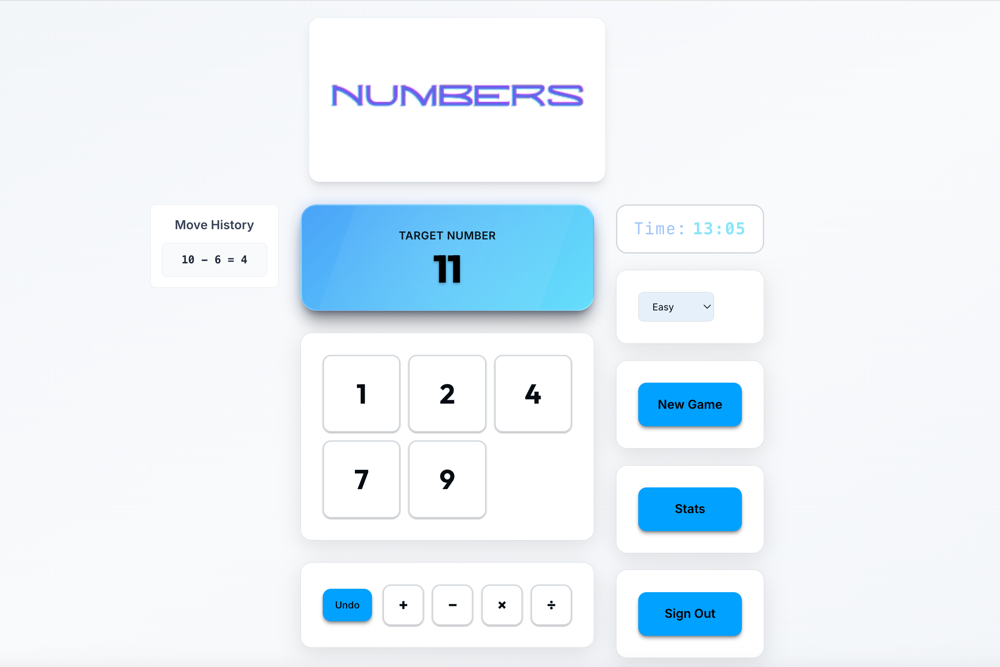

<style>
h1, h2, h3, h4, h5, h6 {
  color: #6366f1 !important;
}
</style>

<p align="center">
  
</p>

This is a personal project that aims to clone the main functionalities of the now defunct Digits game from NYT. Here, you are given 6 different numbers and the goal to combine them in such a way that you end up with the target number. While the project started as a small CLI, it quickly transformed into a fleshed out web project. This repo provides all of the code used to create the following [website](https://numbers-chi-eight.vercel.app/).

The website is currently being hosted using a combination of Vercel + Railway for the frontend and backend respectively.

Interestingly enough, the game is also most likely NP-Hard (a proof that I am currently working on). If I am able to find a reduction from another known NP-Hard problem, I will update the repository with that proof.

<p align="center">
  
  
  
</p>

## Game Features

- **Multiple Difficulty Levels**: Similar to the original game, there are three difficulties which alter the length of the solution to each puzzle
- **User Authentication**: Users have the ability to either play as a guest, or to register an account to save their progress across session
- **Game Statistics**: Either view your local saved stats (games played, average time, average moves, etc.) if playing as guest or your global stats with a registered account
- **Move History**: See the previous moves you've made and undo them if you get stuck
- **Responsive Design**: React + Tailwind gives users the ability to play anywhere, including desktop, mobile, or tablet devices

## Screenshot

<p align="center">
  
</p>

## Quick Start

### Prerequisites
- Docker & Docker Compose
- Git

### Proejct Setup
```bash
git clone <https://github.com/santiagogonzalez915/Numbers>
cd Numbers
docker compose up --build

# Now, simply type in http://localhost:3000 to your browser
```

### Access Points
- **Website:** [https://numbers-chi-eight.vercel.app/](https://numbers-chi-eight.vercel.app/)
- **Game**: http://localhost:3000
- **API Docs**: http://localhost:8000/docs
- **Backend API**: http://localhost:8000

## Configuration

### Environment Variables
Copy `env.example` to `.env` and configure:

```env
# Required
SECRET_KEY=PASSWORD
```

### Docker Commands
```bash
# Production
docker compose up --build    # Build and start
docker compose up -d         # Start in background
docker compose down          # Stop services
docker compose logs -f       # View logs

```

## How to Play

1. **Start a Game**: Choose your difficulty level
2. **Solve the Puzzle**: Use mathematical operations to reach the target number
3. **Track Progress**: View your statistics and improve your skills
4. **Compete**: Challenge yourself to beat your best times


## Tech Stack

### Frontend
- **React 19**
- **Vite**
- **Tailwind CSS**
- **Axios**

### Backend
- **FastAPI**
- **SQLAlchemy**
- **Pydantic**
- **JWT**
- **SQLite**

### DevOps
- **Vercel**
- **Railway**
- **Docker**
- **Nginx**

## License

This project is licensed under the MIT License - see the [LICENSE](LICENSE) file for details.
